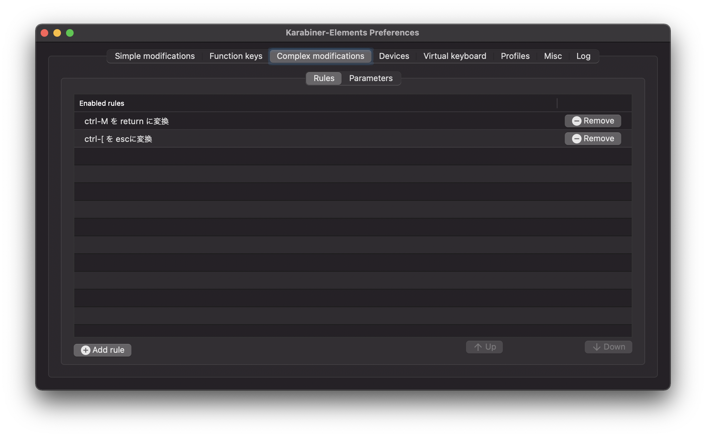

Karabinerで設定ファイルを作ったのでメモ

## やったこと

こんな感じの設定を作った。`ctrl + m` で `return` に、 `ctrl + [` で `esc` に割り当てるだけの単純なキー割り当て。




## つまづいたこと

JISキーボードとUSキーボードで、 `key_code` の内容が違う。
JISキーボードで `[` キーに割当てを行いたい場合は、 `key_code` は `close_bracket` じゃないといけない。

[Karabiner-ElementsでのJIS・USのキーコード対応表 - Qiita](https://qiita.com/akrolayer/items/3cd4b940b367dbb3544f)

## 手順

1. `~/.config/karabiner/assets/complex_modifications/` 内に好きな名前のJSONファイルを作る

2. 上述のJSONファイルに設定を書く

今回の例

```json
{
  "title": "自分用",
  "rules": [
    {
      "description": "ctrl-M を return に変換",
      "manipulators": [
        {
          "type": "basic",
          "from": {
            "key_code": "m",
            "modifiers": {
              "mandatory": [
                "control"
              ]
            }
          },
          "to": [
            {
              "key_code": "return_or_enter"
            }
          ]
        }
      ]
    },
    {
      "description": "ctrl-[ を escに変換",
      "manipulators": [
        {
          "type": "basic",
          "from": {
            "key_code": "close_bracket",
            "modifiers": {
              "mandatory": [
                "control"
              ]
            }
          },
          "to": [
            {
              "key_code": "escape"
            }
          ]
        }
      ]
    }
  ]
}
```

3. Karabinerの設定画面の「Complex modifications」タブの左下にある「Add rule」ボタンを押すと、JSONファイルの設定内容を選べるようになるので、対応する「Enable」ボタンをクリックする。

## 参考

以下のページのほうがより親切に記載されている。

* [MacbookのEscapeキーが押しにくいのでKarabiner-Elementsで別のキーにバインドしてみた](https://chusotsu-program.com/karabiner-escape/)
* [Karabiner-ElementsでのJIS・USのキーコード対応表 - Qiita](https://qiita.com/akrolayer/items/3cd4b940b367dbb3544f)

