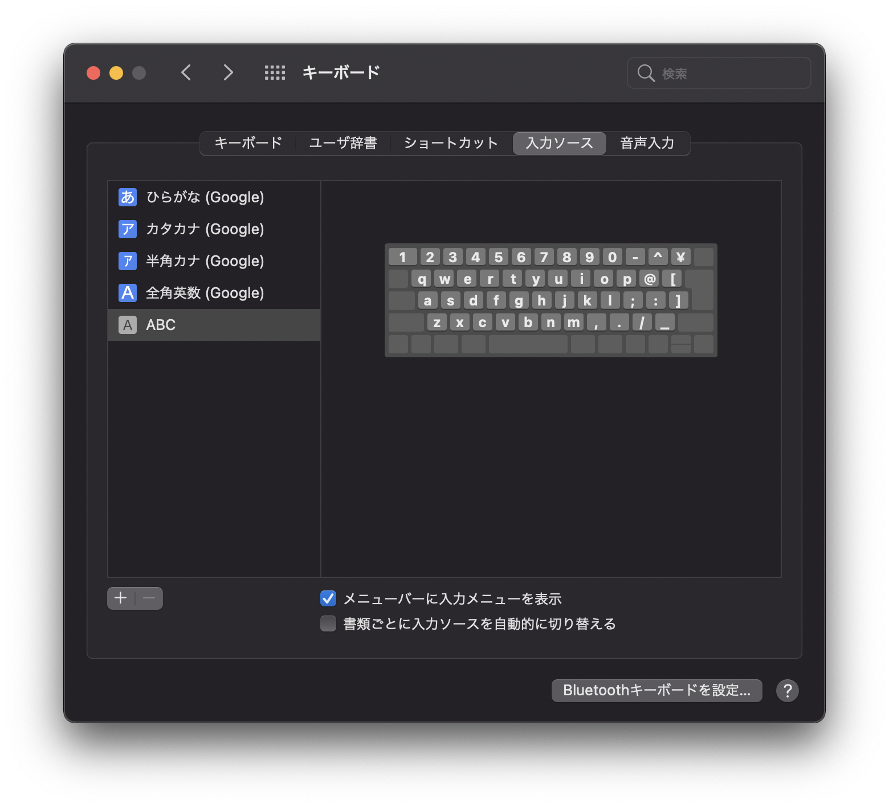

MacBook Air(2020 M1)を使うことになったので、その初期設定についてメモを残す。

## homebrewのインストール

以下の公式ページ内で記載されているコマンドをターミナルに貼り付ければOK。

https://brew.sh/index_ja

### caskの使い方

GUIとかのアプリを入れるときにはcaskというのを指定する必要がある。
ただし、`brew cask ...` というコマンドを実行すると `Error: Unknown command: cask` がでた。

解決方法として、 `brew install --cask ...`を実行するとうまくいった。

### Rosetta 2のインストール

現時点 (2020/02/22) では、いくつかのパッケージはM1チップに対応していないみたい。
例えば `google-japanese-ime` パッケージをインストールしようとしたら、以下のメッセージが表示されていた。どうやらRosetta 2をインストールする必要があるらしい。

```
Please install Rosetta 2 and then try again.
    `sudo softwareupdate --install-rosetta`

installer: Error - GoogleJapaneseInputはこのコンピュータにインストールできません。
```

メッセージに書いてある通り、 `sudo softwareupdate --install-rosetta` を実行すると、以下のメッセージがでてくる。

```
I have read and agree to the terms of the software license agreement. A list of Apple SLAs may be found here: http://www.apple.com/legal/sla/
Type A and press return to agree:
```

ライセンスに同意するなら、`a` を入力してreturnキーを押下すれば、無事Rosetta 2のインストールができ、以下のようなメッセージが表示される。

```
2021-02-22 21:05:53.734 softwareupdate[15033:76808] Package Authoring Error: 071-00840: Package reference com.apple.pkg.RosettaUpdateAuto is missing installKBytes attribute
Install of Rosetta 2 finished successfully
```

## iTermの設定

iTermは `brwe install --cask iterm2` でインストールできる。

### アプリからクリップボードを使用する
デフォルトだと、クリップボードを使用できないみたい。
以下の手順を行い、クリップボードを有効化する。

1. command + `,` で設定ウィンドウを開く
2. General -> Selection -> `Application in terminal may access clipbard`の項目を有効化

### ビープ音を消す

1. command + `,` で設定ウィンドウを開く
2. Profiles -> Terminal -> Silcence bellを有効化

### フォントの拡大ショートカット `Cmd + Shift + ;` を使えるようにする。

以下のURLを参照。
[iTermでcmd+shift+;でフォントサイズが拡大できない - Qiita](https://qiita.com/kanari3/items/d3e96dfae77ecdc5144f)


## OSの起動音がうざい
OSの起動音がうるさかったので無効化する方法をメモ。
イヤホンを挿しているにもかかわらず、大音量で音がなるのはやめてほしい（これは仕様？）

1. システム環境設定を開く
2. サウンド -> サウンドエフェクト -> 起動時にサウンド再生を無効化する

## Spotlightメモ

command + spaceを押したらSpotlightなるアプリが起動する。
テキストの入力欄でアプリ名を入力し、Returnキーを押すことでアプリの起動ができる。
他にも、色々機能はあるみたいだけど、とりあえずはアプリのランチャーとウィンドウ切り替えをメインに使っている。

## なんか勝手に日本語が変換されてうざい
どうやら、IME側での「ライブ変換」という機能が原因みたい。
そこで、馴染みのあるGoogle日本語入力を入れることにした。

Rosetta 2をインストール後、 `brew install --cask google-japanese-ime` でインストールする。

次に、キーボード環境設定の入力ソースで、不要な項目を削除する。設定後の画面しか残っていないが、デフォルトで入っていた日本語の項目を消したと思う・・・



参考: https://genki-wifi.net/googleime

ちなみに、ウィンドウのスクリーンショットを撮ってクリップボードに入れるには以下のキーバインドを使う

Shift + Command + 4 + space + control

参考: https://gori.me/mac/mac-tips/103765

### Google日本語入力のキーバインドがUbuntuのときと違う

Ubuntuのときはctrl + tとかctrl + iでカタカナや半角英数への変換をしていたが、どうもMacだとキーバインドが違うっぽい。

* カタカナへ変換: `ctrl + k`
* 半角英数へ変換: `ctrl + ;`

注意:
* 私の環境はJIS配列のキーボードです
* Spotlightだと `ctrl + k` が効かないっぽい？
